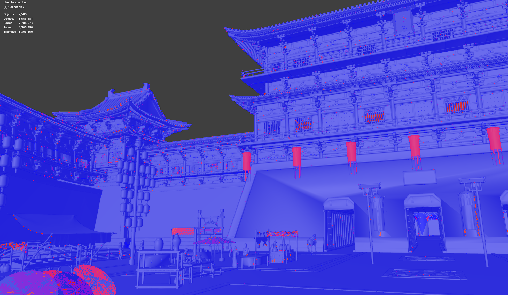
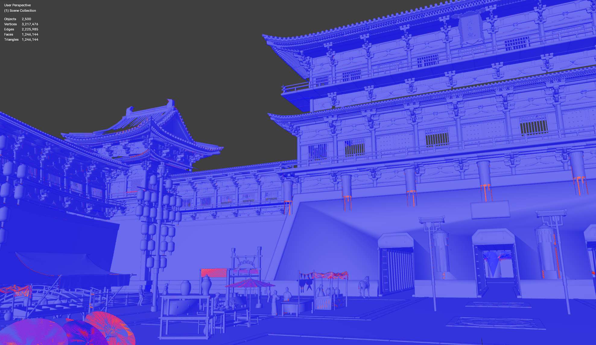
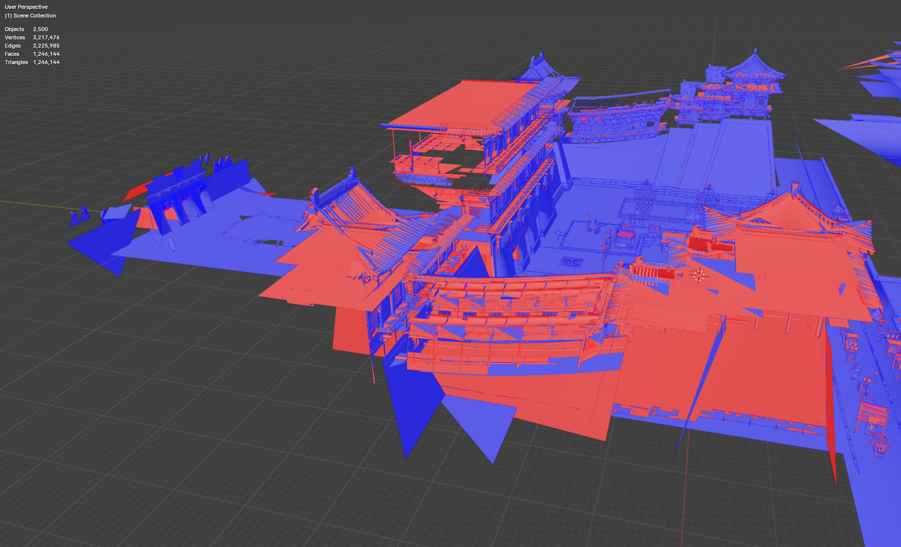
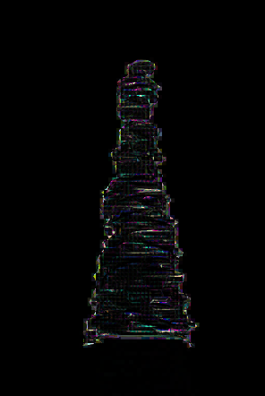
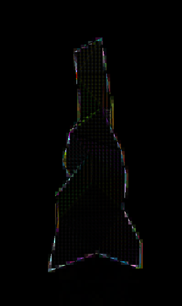
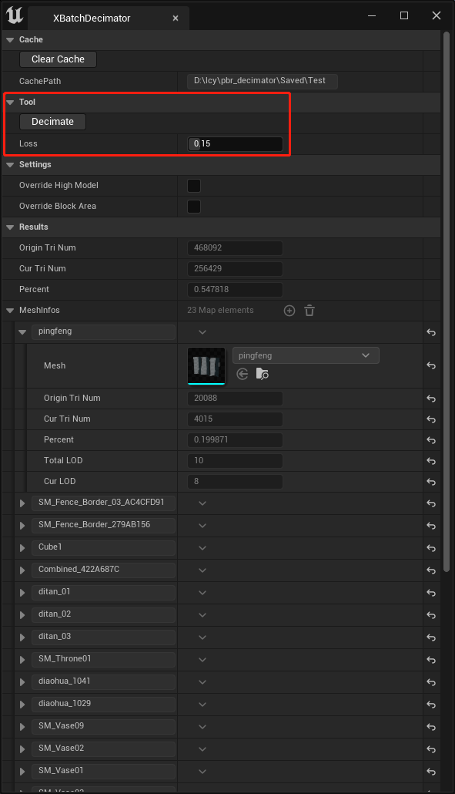
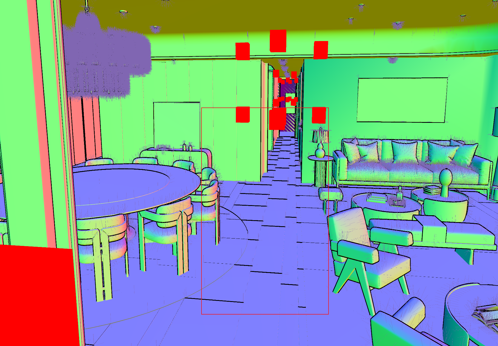
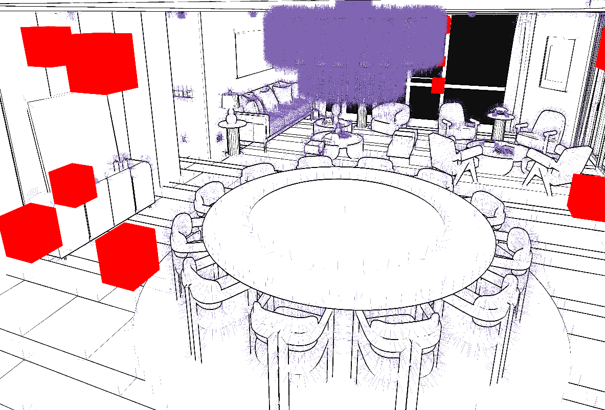

## 项目简介
支持Windows和Linux的小引擎，用于开发小工具和做实验

## 环境配置
opengl > 4.6, ubuntu version >= 22.04

在docker内使用时需要配置GPU

## ubuntu install the following library: 
``` 
sudo apt-get install libxcursor-dev libx11-dev  libxi-dev libxrandr-dev  libxinerama-dev  mesa-utils ninja-build cmake
sudo apt-get install curl build-essential libfreetype-dev libz-dev pkg-config libglu1-mesa-dev mesa-common-dev  libglfw3-dev libgles2-mesa-dev
```

## optional:
1. install clang
```
wget https://apt.llvm.org/llvm.sh
chmod +x ./llvm.sh 
sudo ./llvm.sh 17

```


## check opengl version
```
glxinfo | grep "OpenGL version"
```

## 创建项目
在`CMakeLists.txt`中配置`PROJECT_NAME`和`PROJECT_FILE`即可切换生成的项目。`PROJECT_NAME`对应VS中的项目名称以及编译出的exe的名称，`PROJECT_FILE`是项目根目录名称，`MACRO_NAME`添加预编译宏.

(这俩填一样的)

## 编译
Windows: 执行以下指令，在build目录下会有sln(windows)
```
mkdir build
cd build
cmake ..
```


Ubuntu:
```
mkdir build
cd build
cmake ..
make
```

## 项目介绍(部分)

- 逐视角背面剔除工具 —— MeshDecimator
  剔除前630w，剔除后124w。
    
    侧后方不可见区域网格已删除
    
- 网格拆分工具 —— MeshPartition
  该工具以navmesh可行进区域为中心，按距离进行网格体lod划分，分配不同分辨率的贴图。

- 减面评估工具 —— SimEvaluation，该工具通过对高低模拍照，对比高低模图像空间差异，自适应调整减面比例
  
  高模法线0均值图像
  
  低模法线0均值图像
  
  ```
  上述模型loss = 0.869 ，面数减少60%.
  当loss低于0.95（经验值）时，认定低模减面失真，应调高低模面数保证渲染效果。
  ```
  
  ```
  批量选择UE场景内的Actor，调整Loss值，在保证模型细节的同时，动态调整各actor的减面比例。
  ```

- 杂项 —— 描边、法线绘制




## 模块介绍
- Geometry —— 核心类是XStaticMesh。vcglib套壳，详情见vcglib官方接口文档。
- Resource —— 提供了Texture、Model的导入导出功能。（CPU资源）
    ```cpp
    //导入
    IResource<>::Open<XImporter>(FbxFilepath, AssimpImportSettings())
    IResource<>::Open<XImporter>(ImageFilepath, Texture2DImportSettings())

    //导出
    IResource<>::Save<XExporter>(ModelResource,SavePath, AssimpExportSettings())
    IResource<>::Save<XExporter>(TextureResource,SavePath, Texture2DExportSettings())

    // load model
    std::shared_ptr<XModelMesh> HighModel = nullptr;
    {
        if (auto RH = IResource<>::Open<XImporter>(FbxFilepath, AssimpImportSettings()))
        {
            HighModel = RH->DynamicPointerCast<XModelMesh>();
            HighModel->Register();
        }
    }

    // save model
    IResource<>::Save<XExporter>(*HighModel, SavePath.c_str(), AssimpExportSettings());


    // load texture
    if (auto RH = IResource<>::Open<XImporter>(ImageFilepath, Texture2DImportSettings()))
    {
        Tex2D = RH->DynamicPointerCast<XTexture2D>();
        Tex2D->Register();
    }

    // save texture
    IResource<>::Save<XExporter>(*TexResource, SavePath.c_str(), Texture2DExportSettings());
    ```
- Render —— 提供了opengl接口抽象(RHI)。GPU资源代理(Proxy)。
  
    glsl代码文件请放在项目目录下的Shaders路径下，编好可执行文件后，把Shaders文件夹放在可执行文件的相同目录下。```命令行或python调可执行文件时，请先cd到可执行文件的同级目录。```支持在glsl代码里include其他头文件。
    ```cpp
    // 配置shader文件路径
    XMaterial::ImportShaderHeaderFiles(SHADER_ROOT_DIR);
    XMaterial::ImportShaderHeaderFiles(STR_CAT(SHADER_ROOT_DIR, "Core/"));

	XMaterial::ImportShaderHeaderFiles(ExcutePath + "/Shaders/");
	XMaterial::ImportShaderHeaderFiles(ExcutePath + "/Shaders/Core/");

    // shader声明
    DECLARE_SURFACE_SHADER(FSurfaceShader, "Surface.vert", "Surface.frag")
	DECLARE_COMPUTE_SHADER(FComputeShader, "Compute.comp")

    // 创建shader
    FScopeShader<FSurfaceShader> SurfaceShader;
    FScopeShader<FComputeShader> ComputeShader;
    if (SurfaceShader.IsValid() && ComputeShader.IsValid())
    {
        // DO SOMETHING
    }
    ```
    
    CPU到GPU通信。在ShaderDefines.h里定义宏，在ShaderStructs.h里定义struct。struct要注意c++和glsl地址对齐规则，否则会访问到错误数据。
    ```cpp
    #include "ShaderDefines.h"
    #include "ShaderStructs.h"

    // 在C++里创建字节流Buffer或StructArray
    FByteAddressBuffer<Slot, EBufferUsage::BU_DYNAMIC_COPY> ByteAddressBuffer;
    FStructuredBuffer<Slot, CustomStruct, EBufferUsage::BU_DYNAMIC_COPY> StructuredBuffer;

    // 初始化Buffer资源
    StructuredBuffer.Resize(Num, Value);
    StructuredBuffer.InitRHI();
    
    // 数据更新
    StructuredBuffer[Idx] = Value;
    StructuredBuffer.UpdateSubData(Idx)

    // 读回数据
    StructuredBuffer.ReadBack();
    Value = StructuredBuffer[Idx];

    //绑定buffer
    Shader.GetProgram()->SetBuffer(StructuredBuffer.GetRef());
    
    ```

    ```glsl
    // 在glsl里创建对应的buffer
    #version 460 core

    #include "Core/ShaderCore.glsl"

    #include "ShaderDefines.h"
    #include "ShaderStructs.h"

    FStructuredBuffer(CustomStruct,CustomBuffer,Slot)

    void main()
    {
        // 读取
        CustomStruct Value = GetCustomBuffer();

        // 写入
        SetCustomBuffer(Idx,Value);
    }
    ```

    网格体绘制
    ```cpp
    /*
        通过XStaticMesh创建XStaticMeshProxy
        XStaticMeshProxy隐藏了vbo，ibo，vao和顶点layout的设置细节
    */
    std::vector<XStaticMeshProxy> DrawLists;
    if (auto RH = IResource<>::Open<XImporter>(FbxFilepath, Settings))
    {
        auto Model = RH->DynamicPointerCast<XModelMesh>();
        Model->Register();

        for (std::shared_ptr<XStaticMesh> M : Model->GetMeshes())
            DrawLists.emplace_back(M);
    }

    // 绘制
    for (int i = 0; i < DrawLists.size(); ++i)
    {
        DrawLists[i].GetContainer()->DrawElementInstanced(EDrawMode::DM_TRIANGLES, 1);
    }
    ```


